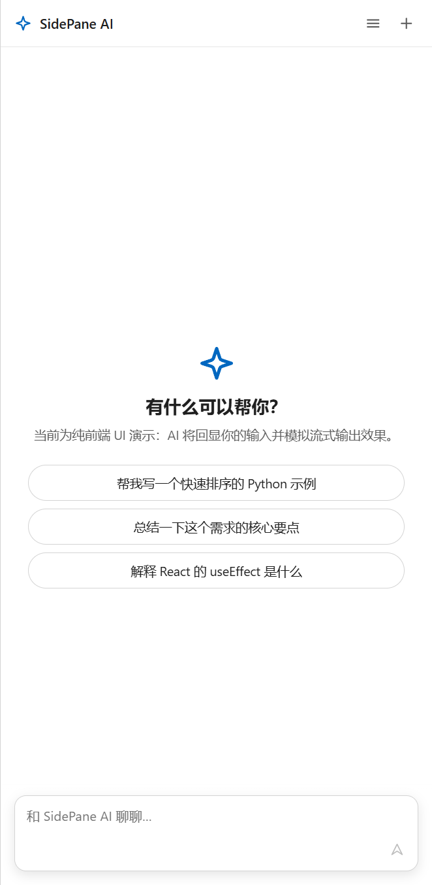

# SidePane UI

一个用于桌面 AI 助手的侧边栏界面起点，使用 React、TypeScript 和 Electron 构建。

> [!IMPORTANT]
> SidePane UI 当前是 **v0.1 Preview**。本仓库只包含 UI 与 Electron 桌面外壳，不包含 Agent 后端、模型调用、服务进程或协议层。对话回复目前由浏览器内的回显流模拟。

<p align="center">
  
</p>

## 为什么做这个项目

不少 AI 客户端都从“聊天页面”开始，但桌面侧边栏还需要处理窗口停靠、随时唤起、流式输出、智能滚动、会话切换和输入区布局等细节。SidePane UI 把这些交互整理成一个边界清晰、容易继续接入后端的开源实现。

## 已实现

- **桌面侧边栏**：停靠当前显示器右侧、滑入滑出、系统托盘、全局快捷键、宽度调节与窗口状态记忆
- **会话管理**：滑出式列表、自动命名、重命名、删除确认、草稿保留和生成状态提示
- **聊天体验**：Markdown 与 GFM、代码高亮、流式输出、中止生成、智能滚动跟随和“回到底部”
- **输入与操作**：自动增高、Enter 发送、Shift+Enter 换行、中文输入法兼容、消息复制与代码块复制
- **界面反馈**：空状态、Toast、模态框、选中文本右键菜单和自定义滚动条

## 快速开始

建议使用 Node.js 22 与 pnpm 11。

```bash
pnpm install
pnpm dev
```

常用命令：

```bash
pnpm dev:web    # 只在浏览器中预览 UI
pnpm build      # 类型检查并构建前端
pnpm preview    # 预览生产构建
```

Electron 桌面版默认停靠在当前显示器右侧，并保持在普通窗口上方。使用 `Ctrl/Cmd + Shift + Space` 显示或隐藏侧边栏，也可以通过系统托盘操作。关闭按钮只会收起窗口；托盘菜单中的“退出”才会结束应用。

## 接入真实后端

模拟回复集中在 [`src/mock/echoStream.ts`](src/mock/echoStream.ts)。接入 HTTP、WebSocket、IPC 或本地 Agent 服务时，可以从替换这一层开始，保留现有的消息状态和流式渲染逻辑。

当前数据全部保存在内存中，应用重启后会话会清空。持久化、身份验证、模型配置与错误恢复均由后续集成方决定。

## 项目结构

```text
src/
  main.tsx / App.tsx        React 入口与界面外壳
  types.ts                  会话与消息类型
  store/ChatStore.tsx       reducer、Context 与流式编排
  mock/echoStream.ts        浏览器内的模拟流式回复
  utils/                    文本与剪贴板工具
  components/               聊天、会话列表、输入框等组件
  styles/                   全局样式与设计令牌
electron/
  main.cjs                  窗口、托盘、快捷键与状态记忆
  preload.cjs               桌面能力桥接
```

## 当前限制

- Windows 是目前主要验证平台；macOS 仅保留基础适配结构。
- 还没有持久化、真实模型连接或安装包构建流程。
- 还没有自动化测试套件；持续集成会执行 TypeScript 检查和生产构建。
- 生产构建中的主 JavaScript 包仍有进一步拆分空间。

## 路线图

- 定义可替换的 Agent/流式传输适配器
- 增加本地会话持久化
- 补充组件和状态层测试
- 完善 macOS 行为验证
- 增加可安装的桌面发布包

## 贡献

欢迎提交 Issue 和 Pull Request。开始前请阅读 [CONTRIBUTING.md](CONTRIBUTING.md)。

## 设计与商标说明

本项目的侧边面板交互受到包括 Microsoft Copilot 在内的桌面助手产品启发，部分交互思路也来自 Yino。SidePane UI 是独立的开源项目，与 Microsoft 没有隶属、赞助或背书关系；文中出现的产品名和商标归各自权利人所有。

## 许可证

本项目采用 [MIT License](LICENSE)。
